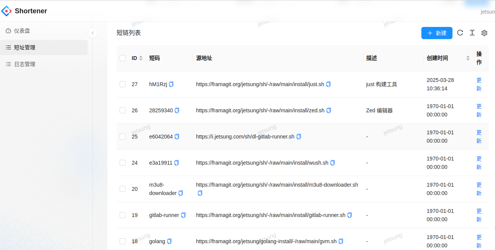

# Shortener Frontend

一个超简单的短网址管理平台（前端）。

[**配置后端 API：shortener-server**](https://git.jetsung.com/idev/shortener-server)

预览: 

## 开发与构建

### 安装依赖

```bash
npm install
```

### 本地开发

1. 更新 OpenAPI
   - 修改 `config/openapi.json`
2. 生成 OpenAPI API

```bash
npm run openapi
```

### 本地运行

```bash
# Mock 模式
npm run start

# Proxy 模式
npm run dev
```

### 构建

```bash
npm run build
```

## 部署

部署教程查看 [**shortener-server**](https://git.jetsung.com/idev/shortener-server#文档) 项目。

## 仓库镜像

- https://git.jetsung.com/idev/shortener-frontend
- https://framagit.org/idev/shortener-frontend
- https://gitcode.com/idev/shortener-frontend
- https://github.com/idevsig/shortener-frontend
